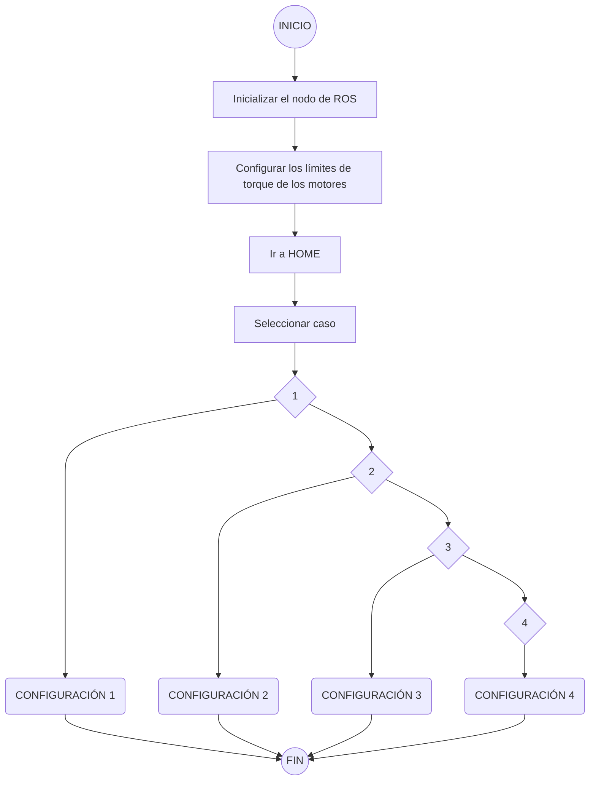

# LAB-4
LABORATORIO 4 DE ROBÓTICA
# Vídeo del brazo alcanzando cada posición solicitada.
[VIDEO DEMOSTRACIÓN DEL LABORATORIO](https://youtu.be/2eLHC9oliu4)
# Gráfica digital de las poses comparándola con la fotografía del brazo real en la misma configuración.
A continuación se presentan las configuraciones del robot de forma digital y en el robot real:

### POSE DE HOME
La pose de HOME corresponde a la pose donde todas las articulaciones están en 0.


### POSE 1
La pose de 1 corresponde a 25, 25, 20, -20, 0.


### POSE 2
La pose de 2 corresponde a -35,35, -30, 30, 0.


### POSE 3
La pose de 3 corresponde a 85, -20, 55, 25, 0.


### POSE 4
La pose de 4 corresponde a 80, -35, 55, -45, 0.


# Descripción de la solución planteada
En el script _LAB4.py_ primero se establecen los torques adecuados para cada motor. Estos valores se obtuvieron empíricamente probando los movimientos con el robot para que estos fueran suaves y no generaran tanta vibración, pero sin que pierdan la fuerza para mantener los demás eslabones.
```Pyhton
# Definición de torques máximos para cada motor
torques = [500, 400, 350, 350, 350]
```

La siguiente función es una de las más relevantes en la solución:
```Python
# Función para enviar comandos a los motores Dynamixel
def send_joint_command(command, id_num, addr_name, value, delay):
    rospy.wait_for_service('dynamixel_workbench/dynamixel_command')
    try:
        dynamixel_command = rospy.ServiceProxy('/dynamixel_workbench/dynamixel_command', DynamixelCommand)
        result = dynamixel_command(command, id_num, addr_name, value)
        rospy.sleep(delay)
        return result.comm_result
    except rospy.ServiceException as exc:
        print(str(exc))
```
Esta función primero espera al servicio de _dynamixel_command_ para crear un comando para los motores Dynamixel.
Los parámetros que espera son:
* ```command```: En el código se usa _''_ porque no se llaman instrucciones de la tabla de control como _ping, reboot_ o _reset_.
* ```id```: El númeor de ID del motor a mover.
* ```addr_name```: Puede ser _Torque_Limit, Goal_Position_ o _Present_Position_ dependiendo del objetivo de la instrucción.
* ```value```: Valor a escribir en la instrucción. 
* ```delay```: Tiempo de espera en segundos antes de ejecutar la siguiente instrucción.
La función devuelve el booleano _comm_result_ que indica si la comunicación fue exitosa.
Esta función es importante ya que es la base del movimiento del robot y se usa en varias partes del código. Primero se usa para llevar el robot a su posición de HOME y también para establecer los torques en cada motor, pasando _Torque_Limit_ como _addr_name_:

```Python
# Configurar los límites de torque de los motores
        for i, torque in enumerate(torques):
            send_joint_command('', i + 1, 'Torque_Limit', torque, 0)
```

También se usa en la función _move_partial_, que es la función que se llama en la función principal para llevar cada eslabón del robot a la posición adecuada de a cuerdo a la configuración seleccionada.
```Python
# Función para mover gradualmente las articulaciones hacia una posición objetivo
def move_partial(joint_index, goal_position, current_position):
    N = 6
    delta = (goal_position - current_position) / N
    for i in range(N):
        send_joint_command('', joint_index + 1, 'Goal_Position', int(current_position + delta * (i + 1)), 0.5)
```
En este caso mueve cada motor uno a uno con un delta entre la posición requerida y la posición actual para que el movimiento sea se mueva poco a poco y con un delay de 0.5 para que sea gradual. Como _N = 6_, cada movimiento lo realiza en 6 partes.

Con la función _send_joint_command_ bien definida en su comportamiento y en sus usos, la función principal sigue el siguiente flujo:


